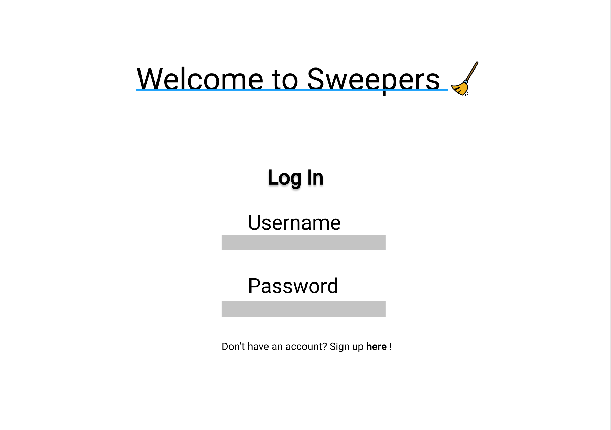
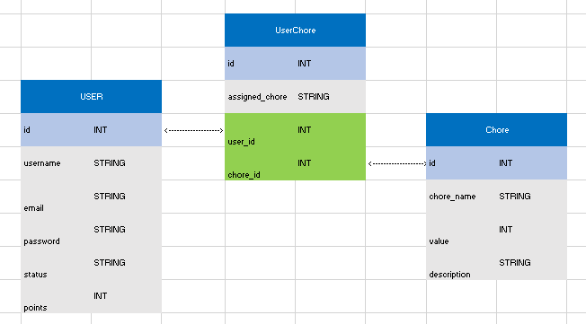

# Sweepers
      

Live Link: https://sweeper-chore-chart.herokuapp.com/

Contributors: Todd Taylor, Christa Baccas, Stephanie Cortez, Jaime Martinez, Keshav Krishnan
## Description

Sweepers is a web based full-stack application designed to help households manage chores and who needs to do them.  Many houses manage chores on paper, but having a web application allows anyone in the household to access the chore chart no matter where they are.  We thought that we could solve this problem, and create a chore chart that we would be happy to use in our own homes. We learned to effectively link and utilise databases through sequel, as well as handlebars and sessions.

## Planning
We started with a wireframe of our two pages, our homepage and chore page.  Originally we had separate pages for log in and sign up, but decided a modal for creating accounts was more streamlined for the user.
Log in page:

Signup page:
.png)
Admin view of the chore page:
.png)
Standard user view of the chore page:
.png)

We also planned the way our databases would interact and created a diagram showing the flow of data.

## Technical Requirements

All technical requirements were accomplished for this project. The technical requirements are as follows: 

- Use a library outside of what we were taught in class (Materialize)
- Be interactive (i.e., accept and respond to user input).
-Include user authentication
- Host servers
- Use databses to store persistent data
- Be responsive to different screen sizes
- Have a polished UI
- Have a clean repository that meets quality coding standards (file structure, naming conventions, follows best practices for class/id naming conventions, indentation, quality comments, etc.)
- Have a quality README (with unique name, description, technologies used, screenshot, and link to deployed application)
- Be deployed to Heroku

## Features

Different levels of user permissions
Multiple linked databases
Functional signup and login

## Credits
- Contributors:
    - Todd Taylor: https://github.com/DerTodd
    - Christa Baccas: https://github.com/christa-baccas
    - Stephanie Cortez: https://github.com/CortezStephanie
    - Jaime Martinez: https://github.com/JAMATX38
    - Keshav Krishnan: https://github.com/Xevshak

Materialize.js: https://github.com/MaterializeInc
Sequelize: https://github.com/sequelize

## Future Development

There are multiple opportunities for future development with this site:
- Adding a log out function
- Creating a way to store and gain points
- Read-only for standard users
- Linking to popular calendar programs
- Graphics on user columns to show progress towards goals
- More complete admin control

## License

MIT License

Copyright (c) [2021] [Sweepers]

Permission is hereby granted, free of charge, to any person obtaining a copy
of this software and associated documentation files (the "Software"), to deal
in the Software without restriction, including without limitation the rights
to use, copy, modify, merge, publish, distribute, sublicense, and/or sell
copies of the Software, and to permit persons to whom the Software is
furnished to do so, subject to the following conditions:

The above copyright notice and this permission notice shall be included in all
copies or substantial portions of the Software.

THE SOFTWARE IS PROVIDED "AS IS", WITHOUT WARRANTY OF ANY KIND, EXPRESS OR
IMPLIED, INCLUDING BUT NOT LIMITED TO THE WARRANTIES OF MERCHANTABILITY,
FITNESS FOR A PARTICULAR PURPOSE AND NONINFRINGEMENT. IN NO EVENT SHALL THE
AUTHORS OR COPYRIGHT HOLDERS BE LIABLE FOR ANY CLAIM, DAMAGES OR OTHER
LIABILITY, WHETHER IN AN ACTION OF CONTRACT, TORT OR OTHERWISE, ARISING FROM,
OUT OF OR IN CONNECTION WITH THE SOFTWARE OR THE USE OR OTHER DEALINGS IN THE
SOFTWARE.

